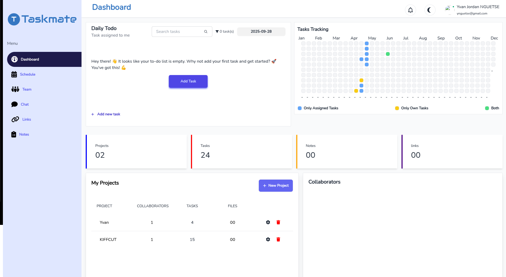
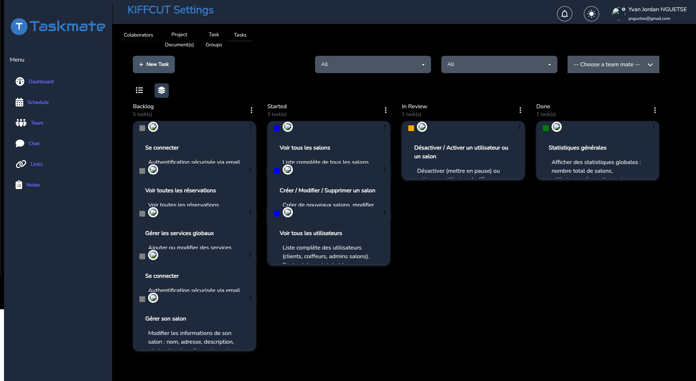
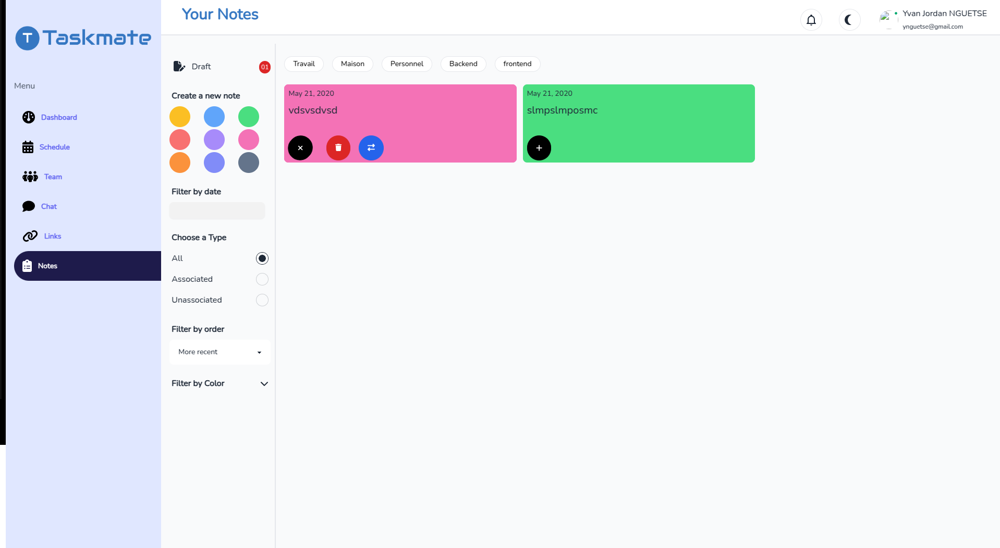

# 📋 Todo Project Manager

A modern, full-featured task management application built with Next.js, featuring collaborative workflows, real-time updates, and an intuitive interface.



## ✨ Features

### 🎯 Core Features
- **Task Management**: Create, update, delete, and organize tasks
- **Project Collaboration**: Invite team members and manage project access
- **Task Phases**: Track progress through Backlog → Started → In Review → Done
- **Real-time Search**: Instantly find tasks with advanced filtering
- **Notes System**: Link notes to tasks for better context
- **Task Assignment**: Assign tasks to specific team members
- **Scheduling**: Reschedule task assignments with date management

### 🔧 Advanced Features
- **Phase Management**: Visual task progression through different phases
- **Collaborator Management**: Add/remove team members from projects
- **Task Types**: Support for different task categories
- **Responsive Design**: Works seamlessly on desktop and mobile
- **Dark Mode Support**: Eye-friendly dark theme
- **Real-time Updates**: Live synchronization across team members

## 🚀 Tech Stack

- **Frontend**: Next.js 13+, React 18, TypeScript
- **State Management**: Redux Toolkit
- **Styling**: Tailwind CSS, DaisyUI
- **Icons**: FontAwesome
- **Forms**: React Hook Form
- **HTTP Client**: Axios
- **Authentication**: JWT Bearer tokens

## 📱 Screenshots

### Dashboard


### Task Management


### Notes System


### Collaboration


## 🛠️ Installation

1. **Clone the repository**
   ```bash
   git clone https://github.com/your-username/todo-project.git
   cd todo-project
   ```

2. **Install dependencies**
   ```bash
   npm install
   # or
   yarn install
   # or
   pnpm install
   ```

3. **Environment Setup**
   ```bash
   cp .env.local.example .env.local
   ```
   
   Configure your environment variables:
   ```env
   NEXT_PUBLIC_API_URL=http://localhost:8000/api
   NEXT_PUBLIC_APP_URL=http://localhost:3000
   ```

4. **Run the development server**
   ```bash
   npm run dev
   # or
   yarn dev
   # or
   pnpm dev
   ```

5. **Open your browser**
   Navigate to [http://localhost:3000](http://localhost:3000)

## 📁 Project Structure

```
todo/
├── app/                    # Next.js 13+ app directory
├── presentation/           # UI components and pages
│   ├── components/        # Reusable React components
│   ├── pages/            # Page components
│   └── styles/           # Styling files
├── Infrastructure/        # External services and APIs
│   └── Services/         # API service layers
├── domain/               # Business logic and entities
│   ├── entities/        # TypeScript interfaces
│   └── enum/           # Application enums
├── public/              # Static assets
└── README.md
```

## 🎮 Usage

### Creating a Task
1. Navigate to your project dashboard
2. Click "Create Task"
3. Fill in task details (title, description, assignee)
4. Set the initial phase and priority
5. Save your task

### Managing Task Phases
- **Backlog**: Initial task planning
- **Started**: Work in progress
- **In Review**: Ready for review
- **Done**: Completed tasks

### Collaboration
1. Go to project settings
2. Click "Add Collaborator"
3. Enter team member email
4. Set permissions and role
5. Send invitation

### Search & Filter
- Use the search bar to find specific tasks
- Filter by phase, assignee, or date
- Advanced search with multiple parameters

## 🔧 Available Scripts

- `npm run dev` - Start development server
- `npm run build` - Build for production
- `npm run start` - Start production server
- `npm run lint` - Run ESLint
- `npm run type-check` - Run TypeScript checks

## 🤝 Contributing

1. Fork the repository
2. Create your feature branch (`git checkout -b feature/amazing-feature`)
3. Commit your changes (`git commit -m 'Add amazing feature'`)
4. Push to the branch (`git push origin feature/amazing-feature`)
5. Open a Pull Request

## 📋 API Endpoints

### Tasks
- `GET /project/tasks` - Fetch all tasks
- `POST /project/tasks/create` - Create new task
- `PUT /project/tasks/update/:id` - Update task
- `DELETE /project/tasks/delete/:id` - Delete task
- `GET /project/tasks/search` - Search tasks

### Collaboration
- `GET /project/collaborators/:id` - Get project collaborators
- `POST /project/tasks/assign/:projectId` - Assign task to users
- `POST /project/tasks/reschedule/:projectId/:taskId` - Reschedule task

## 🔐 Authentication

This app uses JWT-based authentication. Make sure to:
1. Include the Bearer token in API requests
2. Handle token expiration gracefully
3. Implement proper logout functionality

## 🌟 Roadmap

- [ ] Real-time notifications
- [ ] File attachments for tasks
- [ ] Time tracking functionality
- [ ] Advanced reporting and analytics
- [ ] Mobile app (React Native)
- [ ] Integration with external tools (Slack, Discord)

## 🐛 Known Issues

- Search debouncing might cause slight delays on slow connections
- Dark mode toggle requires page refresh in some cases

## 📄 License

This project is licensed under the MIT License - see the [LICENSE](LICENSE) file for details.

## 🙋‍♂️ Support

If you encounter any issues or have questions:
- Open an issue on GitHub
- Contact the development team
- Check the documentation wiki

---

<div align="center">
  <strong>Built with ❤️ by [Your Name]</strong>
</div>
